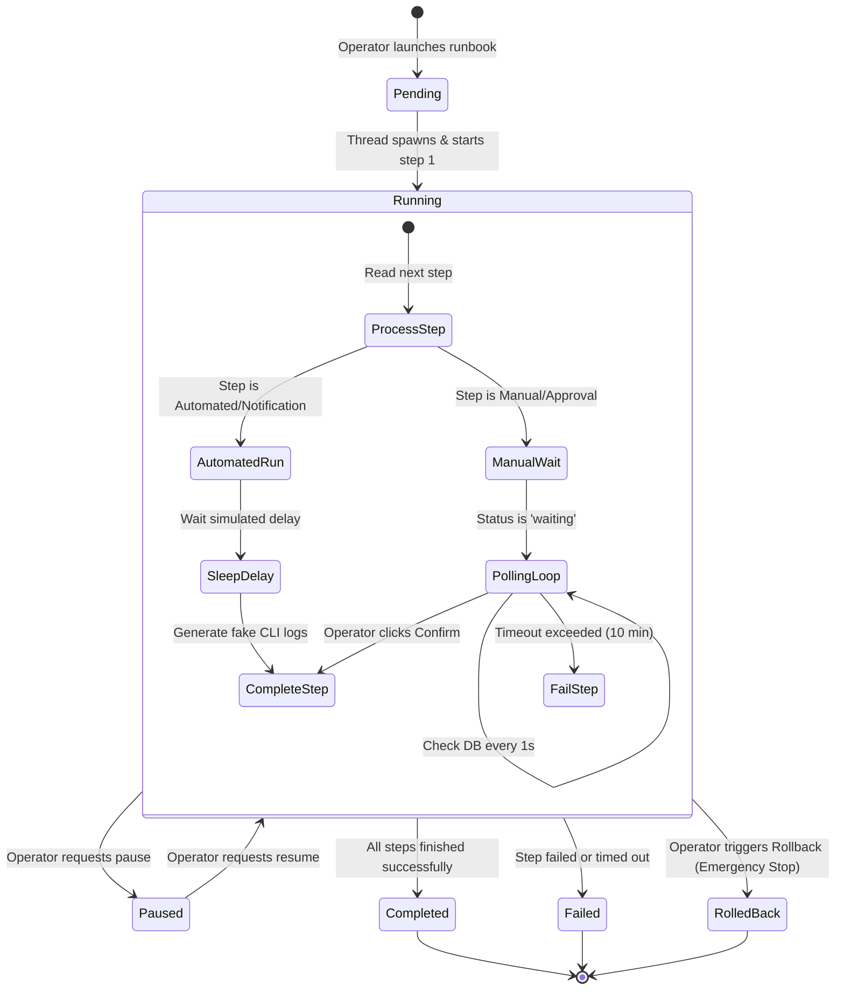

# K8s DR Orchestrator — Technical Documentation

The **K8s DR Orchestrator** is a lightweight, self-contained web application designed for Kubernetes Disaster Recovery planning, testing, and execution. It allows operations teams to register K8s clusters, define structured recovery steps (Runbooks), execute real-time failover/failback runs, monitor executions with live console outputs, and track RTO (Recovery Time Objective) compliance metrics.

---

## 1. System Architecture

The application is built as a single-page application (SPA) frontend served by a Flask backend with a local SQLite database.

```mermaid
graph TD
    subgraph Client Browser (Frontend SPA)
        Router[Hash Router] --> |Mounts Page| Views[Views & Pages]
        Views --> |Uses| CustomCharts[SVG Custom Charts]
        Views --> |Calls| ApiClient[API Client]
    end

    subgraph Flask Backend (Python)
        ApiClient --> |HTTP REST| FlaskApp[Flask App & Blueprints]
        FlaskApp --> |Static Server| Static[Static Assets & Index.html]
        FlaskApp --> |ORM| SQLAlchemy[Flask-SQLAlchemy]
        SQLAlchemy --> |Reads/Writes| SQLiteDB[(SQLite DB)]
        
        FlaskApp --> |Triggers| ExecEngine[Background Execution Engine]
    end

    subgraph Background Executions
        ExecEngine --> |Spawns Thread| ThreadPool[Daemon Threads]
        ThreadPool --> |Runs automated/manual loops| DbCommit[DB Status Updates]
        DbCommit --> SQLiteDB
    end
```

### Component Details
* **Frontend SPA Router:** A custom hash-based JavaScript client-side router (`router.js`) handles page transitions without reloading the browser. It maps hash changes (e.g. `#/clusters`, `#/execution/:id`) to page-rendering functions.
* **Backend Flask Blueprints:** The application splits its REST API endpoints into modular blueprints located in the `routes/` directory (e.g. clusters, runbooks, executions, audit, analytics, settings).
* **Background Execution Engine:** An execution service (`execution_engine.py`) spans a background thread for each active disaster recovery execution. It runs through runbook steps sequentially, handles timer calculations, and supports pausing, resuming, rolling back, and polling for manual operator approvals.

---

## 2. Technology Stack

* **Language & Backend Framework:** Python (3.x) and Flask (3.1.1)
* **Database & ORM:** SQLite database file (`dr_orchestrator.db`) managed via Flask-SQLAlchemy (3.1.1)
* **CORS Management:** Flask-CORS (5.0.1) for enabling cross-origin browser requests
* **Frontend:**
  * **Markup:** Semantic HTML5 (`templates/index.html` acting as the single mounting entry point)
  * **Styling:** Vanilla CSS3 (modern glassmorphism layout, sleek dark palette, and custom micro-animations)
  * **Scripting:** Pure ES Modules JavaScript (vanilla routing, component loading, and dynamic SVG chart drawing without bulky bundlers or frameworks)

---

## 3. Database Schema & Data Models

The database contains six main models defining the registered clusters, recovery workflow templates, executions, and operational audit trails.

### 3.1. Cluster (`clusters`)
Represents registered Kubernetes environments managed through Rancher.

| Field Name | Type | Key | Description |
| :--- | :--- | :--- | :--- |
| `id` | String(64) | PK | Unique cluster identifier (e.g., `cluster-001`). |
| `name` | String(128) | Unique | Human-readable cluster name. |
| `region` | String(64) | - | Cloud or geographic region (e.g., `US-East`, `EU-West`). |
| `datacenter` | String(64) | - | Target datacenter name. |
| `environment` | String(32) | - | Environment name (defaults to `Production`). |
| `dr_type` | String(16) | - | Recovery type: `stretched` (same cluster failover) or `split` (separate target DR cluster). |
| `dr_partner_id`| String(64) | FK | Self-referential key pointing to the failover partner cluster (for `split` DR). |
| `rancher_url` | String(512) | - | URL to access the cluster via Rancher console. |
| `status` | String(32) | - | Current health: `healthy`, `degraded`, `failover-active`, `maintenance`. |
| `node_count` | Integer | - | Number of production-labeled worker nodes. |
| `dr_node_count`| Integer | - | Number of DR-labeled worker nodes (used in stretched configurations). |
| `applications` | Text | - | JSON-encoded array string listing hosted application names. |
| `last_dr_test` | DateTime | - | Timestamp of the most recent completed DR execution run. |
| `rto_minutes` | Integer | - | Recovery Time Objective (in minutes). |
| `rta_minutes` | Integer | - | Recovery Time Actual (in minutes) from the last successful DR run. |
| `tags` | Text | - | JSON-encoded array string containing metadata tags (e.g. tier-1 compliance). |

### 3.2. Runbook (`runbooks`)
Defines the template for a disaster recovery workflow (e.g., failover or failback).

| Field Name | Type | Key | Description |
| :--- | :--- | :--- | :--- |
| `id` | String(64) | PK | Unique runbook ID (e.g., `rb-stretched-failover`). |
| `name` | String(256) | - | Runbook template title. |
| `dr_type` | String(16) | - | Compatible cluster DR type: `stretched` or `split`. |
| `description` | Text | - | Detailed documentation on the purpose of this runbook. |
| `created_at` | DateTime | - | Date and time the runbook template was created. |
| `updated_at` | DateTime | - | Date and time the runbook template was last updated. |
| `is_template` | Boolean | - | Flag indicating if this is an reusable template (defaults to `True`). |

### 3.3. Runbook Step (`runbook_steps`)
Specifies configured individual tasks that compose a Runbook template.

| Field Name | Type | Key | Description |
| :--- | :--- | :--- | :--- |
| `id` | String(64) | PK | Unique step ID. |
| `runbook_id` | String(64) | FK | Foreign key pointing to `runbooks.id`. |
| `order` | Integer | - | Sort order of step execution (1-indexed). |
| `name` | String(256) | - | Step action name. |
| `description` | Text | - | Instructions or detailed action explanation. |
| `step_type` | String(32) | - | Type of step: `automated`, `manual`, `approval`, `notification`. |
| `estimated_seconds`| Integer | - | Target time budget for this step. |
| `command` | Text | - | Simulated shell commands executed during failover. |
| `rollback_command`| Text | - | Command executed if step failover fails and rollback is triggered. |
| `depends_on` | Text | - | JSON-encoded array list of prerequisite step IDs. |

### 3.4. Execution (`executions`)
Records an active or historical instance of running a runbook template against a specific cluster.

| Field Name | Type | Key | Description |
| :--- | :--- | :--- | :--- |
| `id` | String(64) | PK | Unique execution instance identifier. |
| `runbook_id` | String(64) | FK | Foreign key referencing `runbooks.id`. |
| `cluster_id` | String(64) | FK | Foreign key referencing `clusters.id`. |
| `status` | String(32) | - | Current state: `pending`, `running`, `paused`, `completed`, `failed`, `rolled-back`. |
| `started_at` | DateTime | - | Start time of the execution run. |
| `completed_at` | DateTime | - | Completion time (success, failure, or rollback completion). |
| `started_by` | String(128) | - | Username of the operator who triggered the run (defaults to `operator`). |
| `total_steps` | Integer | - | Total count of steps in this execution. |
| `completed_steps`| Integer | - | Count of successfully finished steps. |
| `current_step_id`| String(64) | - | Step ID of the task currently being processed. |

### 3.5. Execution Step (`execution_steps`)
Tracks the individual step runtime state, outputs, errors, and progress timestamps for a specific execution.

| Field Name | Type | Key | Description |
| :--- | :--- | :--- | :--- |
| `id` | String(64) | PK | Unique step instance identifier. |
| `execution_id` | String(64) | FK | Foreign key pointing to `executions.id`. |
| `runbook_step_id`| String(64) | FK | Foreign key pointing to `runbook_steps.id`. |
| `order` | Integer | - | Sequential order index. |
| `name` | String(256) | - | Step action title. |
| `step_type` | String(32) | - | Type: `automated`, `manual`, `approval`, `notification`. |
| `status` | String(32) | - | State: `pending`, `running`, `waiting`, `completed`, `failed`, `skipped`. |
| `started_at` | DateTime | - | Step start time. |
| `completed_at` | DateTime | - | Step end time. |
| `output` | Text | - | Consolidated text logs/standard CLI output. |
| `error` | Text | - | Error stack trace/messages if the step failed. |
| `estimated_seconds`| Integer | - | Configured estimated time. |
| `command` | Text | - | Shell command line executed. |

### 3.6. Audit Log (`audit_log`)
Immutable trail tracking all user actions, system-triggered events, and state changes.

| Field Name | Type | Key | Description |
| :--- | :--- | :--- | :--- |
| `id` | Integer | PK | Auto-incrementing identifier. |
| `timestamp` | DateTime | - | Event timestamp (UTC timezone). |
| `user` | String(128) | - | Username responsible for the action (e.g., `operator`, `system`). |
| `action` | String(128) | - | Action executed (e.g., `execution.started`, `execution.completed`, `step.confirmed`). |
| `resource_type` | String(64) | - | Affected resource type (`execution`, `cluster`, etc.). |
| `resource_id` | String(64) | - | Target resource ID. |
| `details` | Text | - | JSON-encoded string describing transaction metadata. |
| `cluster_name` | String(128) | - | Target cluster name associated with the log. |
| `severity` | String(16) | - | Importance levels: `info`, `warning`, `critical`. |

---

## 4. Disaster Recovery Execution Lifecycle

The execution flow implements a robust state machine handled by the backend execution engine.



### Step Resolution Detail
1. **Automated & Notification Steps:** The engine simulates processing by calculating a mock sleep interval (capped at 8 seconds). It then appends formatted CLI-like progress logs (connecting to cluster, verifying service accounts, executing command strings) to the step output and sets the state to `completed`.
2. **Manual & Approval Steps:** The engine sets the step status to `waiting` and publishes a message "Awaiting manual confirmation...". It then blocks the thread and enters a loop polling the SQLite database every second. Once an operator clicks the **Confirm** button on the UI (which triggers a POST request to `/api/executions/<id>/steps/<step_id>/confirm`), the DB state updates, the loop detects the change, and execution resumes.
3. **Control Commands:**
   * **Pause:** Interrupts the thread using a thread synchronization event wrapper. The execution is flagged as `paused`.
   * **Resume:** Sets the synchronization event wrapper, unblocking the thread to continue processing.
   * **Rollback:** Flags the execution stop toggle. The engine skips any subsequent steps, triggers rollback command scripts (if defined), and marks the status as `rolled-back`.

---

## 5. Frontend SPA Architecture & UI Components

The application UI is structured as a glassmorphism dashboard built using vanilla web technologies.

### 5.1. Router (`router.js`)
* Employs hash routing (`window.location.hash`), avoiding server-side page routing issues.
* Listens to the `hashchange` browser event, parses query strings and route parameters (e.g. extracts `:id` from `#/execution/:id`), matches routes to page modules, renders HTML directly into the `#page-mount` container, and highlights active items in the navigation sidebar.

### 5.2. Page Modules (`static/js/pages/`)
* **dashboard.js:** Displays the *Command Center* with high-level statistics cards, the interactive 70-cluster geographic inventory map (color-coded dots representing healthy, degraded, maintenance, and failover states), active recovery runs, and recent activity logs.
* **clusters.js:** Lists all registered Kubernetes clusters with detailed cards, full filters (environment, status, DR model, region search), and edit forms for adjusting compliance target parameters (RTO) and node details.
* **runbooks.js:** Manages template workflows. Operators select a template (failover or failback) and map it to a compatible cluster target to spin up new execution tracks.
* **execution.js:** The live execution cockpit. Displays the timeline checklist, progress percentage bar, elapsed time stopwatch, and live CLI logging box. It exposes **Pause**, **Resume**, and **Rollback** control buttons.
* **analytics.js:** Tracks disaster recovery readiness scores, MTTR averages, test frequency count, and compliance metrics.
* **audit.js:** Presents an audit log explorer table with rich filters (by user, severity level, cluster name, date range) and a button to request a CSV file download.
* **settings.js:** Configures system defaults (RTO times per tier, Slack/Email integration hooks, theme options).

### 5.3. Components (`static/js/components/`)
* **charts.js:** Hand-crafted, lightweight SVG chart generator. Renders donut, horizontal bar, and vertical column charts dynamically directly using SVG coordinates and native styling without dependencies.
* **sidebar.js** & **header.js:** Renders shell layouts, sidebar menus, logo graphics, and environment profiles.
* **timeline.js:** Generates step-by-step progress tracking lists used inside the execution cockpit.
* **toast.js:** Handles global visual status alerts (success, info, warning, error popup notifications).

---

## 6. REST API Endpoint Catalog

All API endpoints return JSON formats (except the audit CSV export).

### 6.1. Clusters (`routes/api_clusters.py`)
* `GET /api/clusters` - Lists all clusters. Optional query parameters: `region`, `dr_type`, `status`, `search`.
* `GET /api/clusters/summary` - Provides aggregate counts for the Command Center dashboard.
* `GET /api/clusters/<cluster_id>` - Returns metadata for a single cluster.
* `PUT /api/clusters/<cluster_id>` - Updates cluster properties (`status`, `rto_minutes`, `tags`).

### 6.2. Runbooks (`routes/api_runbooks.py`)
* `GET /api/runbooks` - Lists all template runbooks.
* `GET /api/runbooks/<runbook_id>` - Retrieves runbook details and its list of steps.
* `POST /api/runbooks` - Creates a new runbook template and populates its associated step rules.
* `PUT /api/runbooks/<runbook_id>` - Modifies details of a runbook template.
* `DELETE /api/runbooks/<runbook_id>` - Deletes a runbook template and its associated steps.

### 6.3. Executions (`routes/api_executions.py`)
* `GET /api/executions` - Retrieves execution history. Filters: `status`, `cluster_id`.
* `GET /api/executions/<exec_id>` - Retrieves progress, metadata, and detailed step status for an execution.
* `POST /api/executions` - Spawns a background thread and triggers a new execution run. Expects `runbook_id`, `cluster_id`, and `started_by`.
* `POST /api/executions/<exec_id>/pause` - Pauses an active execution.
* `POST /api/executions/<exec_id>/resume` - Resumes a paused execution.
* `POST /api/executions/<exec_id>/rollback` - Triggers an emergency abort and rollback of the execution.
* `POST /api/executions/<exec_id>/steps/<step_id>/confirm` - Confirms a manual task or approval gate, advancing the execution thread.
* `GET /api/executions/<exec_id>/logs` - Aggregates outputs and error streams of all steps for log output.

### 6.4. Audit Logs (`routes/api_audit.py`)
* `GET /api/audit` - Retrieves filtered logs. Filters: `cluster`, `action`, `severity`, `user`, `from`, `to`, `limit`.
* `GET /api/audit/export` - Compiles all audit data and downloads it as a CSV file (`audit_trail.csv`).

### 6.5. Analytics (`routes/api_analytics.py`)
* `GET /api/analytics/rto-compliance` - Returns RTO target vs RTA performance for tested clusters.
* `GET /api/analytics/test-frequency` - Tracks number of DR operations per cluster over the past 365 days.
* `GET /api/analytics/success-rate` - Provides total runs, completions, failures, and rolling success rates.
* `GET /api/analytics/mttr` - Returns monthly average Mean Time To Recover (MTTR) trends.
* `GET /api/analytics/readiness` - Returns calculated readiness scores (0-100) per cluster based on health, testing recency, RTO compliance, and configuration redundancy.

---

## 7. Data Seeding & Database Initialization

Upon starting, Flask runs table initialization and triggers database seeding (`seed_data.py`) if no records exist:
1. **Mock Clusters:** Generates 70 production environments distributed across regions: `US-East` (20), `US-West` (16), `Canada-Central` (14), `EU-West` (12), and `APAC-Southeast` (8). About 57% are Stretched clusters; the remaining are split configurations bound to reciprocal DR partners.
2. **Templates:** Populates four disaster recovery runbooks with realistic commands and timings:
   * *Stretched Cluster Failover* (automated cordoning, pod rescheduling).
   * *Split Cluster Failover* (scaling down prod, ingress redirection, scaling up DR cluster).
   * *Stretched Cluster Failback* (uncordoning, graceful draining, restoring prod alerts).
   * *Split Cluster Failback* (restoring prod scale-up, switching ingress, shutting down DR cluster).
3. **History:** Populates 20 historical runs with completed step logs, durations, and audit log profiles, creating realistic trends for the Analytics views.

---

## 8. Launching the App

To run the application locally:
1. Install dependencies:
   ```bash
   pip install -r requirements.txt
   ```
2. Start the server:
   ```bash
   python app.py
   ```
3. Open a web browser to `http://127.0.0.1:5000`. The database `dr_orchestrator.db` is created and seeded automatically on the first run.
